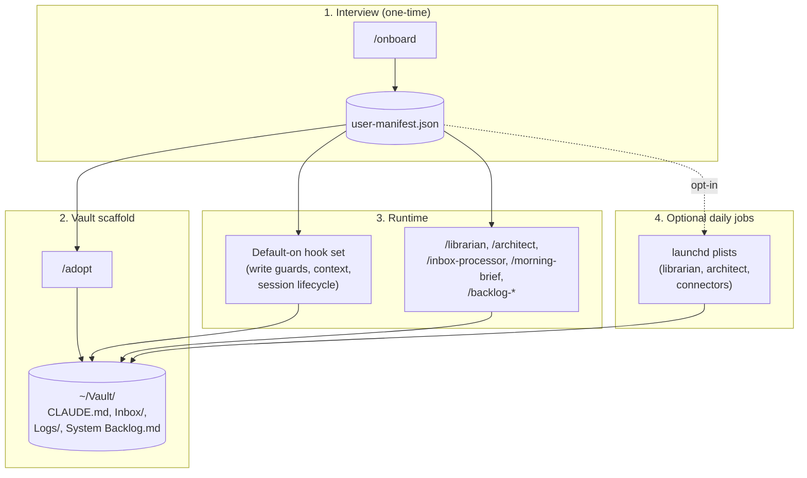

# Claude Stem

A personalization layer for [Claude Code](https://www.anthropic.com/claude-code) — Anthropic's command-line agent that runs Claude in your terminal.

Claude Stem helps Claude Code remember who you are and where your notes live. You answer interview questions once (typed or spoken). The system writes a single configuration file that describes your role, your folder of notes, and your preferences. Skills and runtime guards read that file at runtime, so your customizations don't have to be hand-edited per machine.

> macOS only. Single-user. Apache-2.0.

---

## Plain-language vocabulary

A few terms used throughout this README. If any are familiar, skim past.

- **Claude Code** — Anthropic's CLI for Claude. You type `claude` in a terminal; you get a chat with the model that can run shell commands, edit files, and call tools. It reads `~/.claude/` for configuration.
- **Vault** — your folder of markdown notes. The system uses [Obsidian](https://obsidian.md)'s vault concept: a directory of `.md` files. You don't need Obsidian itself; any editor works.
- **Manifest** — a single JSON file at `~/.claude/user-manifest.json` that holds your name, your vault path, your role, your preferences. Almost everything in the system reads from it. Think "config, but generated for you, and structured."
- **Hook** — a shell command Claude Code runs at lifecycle events (before a write, on session start, etc). The system ships a default-on hook set that blocks dangerous writes and surfaces context.
- **Skill** — a slash command you type in Claude Code (e.g. `/onboard`, `/librarian`). Each is a directory under `~/.claude/skills/` with a `SKILL.md` body Claude reads at invocation.
- **Frontmatter** — the YAML block at the top of a markdown file (`---` to `---`) that carries structured metadata (`type`, `tags`, etc).
- **Slash command** — a command typed in the Claude Code prompt starting with `/`, like `/onboard`.

---

## Is this for you?

| If you... | This repo is... |
|---|---|
| Use Claude Code daily and have *not* customized it yet | A starting point. Skip the months of trial-and-error and inherit a working stack. |
| Use Claude Code and have wired your own hooks / skills already | A reference. Cherry-pick patterns; don't replace what works. |
| Have an Obsidian vault, or are willing to start one | A natural fit. The system scaffolds and maintains a vault for you. |
| Use Notion / Apple Notes and want to keep them | Not a great fit. The system assumes a folder of `.md` files. |
| Run Linux or Windows | Not a fit. macOS only — the cron substrate is `launchd`. |
| Don't have an Anthropic API key | Partial fit. Onboarding's optional auto-authoring step calls a paid LLM (the Claude API), and a few skills do too. The core (interview, vault scaffold, runtime hooks, daily jobs) works without one. |

If you're undecided after the table: skim [`docs/personalization-model.md`](docs/personalization-model.md). It's the cleanest summary of what the system does and does not auto-generate.

---

## What you get

- **`/onboard`** — a guided interview. Five sections, ~25 minutes. Voice-first (you talk, Claude transcribes and extracts) with a typed fallback. Produces `user-manifest.json` plus an optional staged scheduled job.
- **`/adopt`** — scaffolds a vault skeleton from the manifest: directories, a personalized `CLAUDE.md`, a backlog index, a `Plans/` symlink. Or retrofits an existing vault with a collision-matrix preview before any writes.
- **A generic skill set** — `/librarian` (vault hygiene), `/architect` (strategic review of your setup), `/inbox-processor`, `/meeting-note-ingestor`, `/morning-brief`, `/backlog-{triage,research,hygiene}`, `/seed-projects`. Each reads the manifest at runtime.
- **Default-on runtime guards** — hooks that block dangerous writes (deny rule for plans missing a status field; deny rule for cron wrappers using bash 4+ syntax that breaks silently on macOS), validate frontmatter, surface session-checkpoint reminders when the context window fills, and prevent multiple Claude Code sessions from corrupting each other's state.
- **Optional daily jobs** — `librarian` (vault hygiene scan) and `architect` (recommendations report) can run unattended on a schedule. Both off by default.
- **Optional MCP connectors** — wire Granola, Calendar, Gmail, etc. to a daily cron job that pulls into your vault. Wizard at `/connectors`. Today the repo ships one reference template (Granola); the wizard supports more.
- **Honest installer** — defaults to dry-run; refuses to clobber an existing `~/.claude/` without an explicit confirmation phrase; uninstall preserves anything you've edited (SHA-256 fingerprint per shipped file).

The voice-first onboarder is the most distinctive UX. You talk for 3–5 minutes per section ("I'm a backend engineer at Acme; I work on three active services; the people I sync with most are…"). The system extracts structured fields from the transcript with confidence gates: high-confidence values populate silently; medium-confidence values surface as "is this right?" yellow flags; low-confidence required fields trigger one surgical follow-up question. You see an editable summary before anything commits. Total interaction time ≈ 25 minutes.

---

## 60-second start

```bash
# 1. Clone
git clone https://github.com/peter-claude-vault/claude-stem.git
cd claude-stem

# 2. Inspect what install.sh would do (default is DRY-RUN — nothing gets written)
CLAUDE_HOME=$HOME/.claude ./install.sh

# Read the action plan it prints. When you're ready to write:
CLAUDE_HOME=$HOME/.claude ./install.sh --apply

# 3. Inside Claude Code, run the interview
claude
> /onboard

# 4. Scaffold your vault from your answers
> /adopt
```

After step 4, you have a working vault skeleton at the path you declared during onboarding. Drop a note in `<vault>/Inbox/` and the standing inbox processor (described in [`docs/what-runs-on-your-machine.md`](docs/what-runs-on-your-machine.md)) will route it next time it fires.

> **If you already have a populated `~/.claude/`** (from previous Claude Code use), step 2's `--apply` will refuse to write. The installer treats your existing directory as a foreign environment and demands you read [`docs/install-corruption-incident.md`](docs/install-corruption-incident.md) — about a one-page postmortem of why this guard exists — and confirm by typing the sentinel phrase the doc names. Two physical actions are required, and the installer will not silently overwrite your existing configuration.

> **Cost.** Steps 2 and 4 don't call any API. Step 3's interview can either be deterministic (no LLM call) or include LLM-driven extraction; with extraction enabled, expect roughly $0.50–$2 in Anthropic API spend total for the full interview. The optional Section F auto-authoring (which composes a personalized `CLAUDE.md` and seeds the architect's research topics) adds another $0.50–$2 if you opt in. See [`docs/llm-cost-model.md`](docs/llm-cost-model.md). You can pass `--skip-auto-author` to skip Section F entirely.

> **What runs unattended.** Out of the box: nothing. The installer stages launchd plists (macOS scheduled jobs) but does not activate them. You activate them with a separate command (`claude system enable-daemon`) when you decide what should run on a schedule. See [`docs/what-runs-on-your-machine.md`](docs/what-runs-on-your-machine.md) for the inventory.

### Bring your own notes (optional)

If you already have meeting transcripts, drafts, or reference material:

```bash
> /onboard --seed-content ~/path/to/existing/notes
```

After the standard interview, the system clusters your seed content, proposes a vault taxonomy via LLM, and renders a markdown plan. Nothing is written to your vault until you accept the plan.

---

## How the pieces fit



The manifest is the central configuration file. Skills, hooks, and cron jobs read from it at runtime. (The repo's hooks are not yet 100% manifest-driven — a few still resolve `~/.claude` directly. See [`hooks/README.md`](hooks/README.md) for the current state.)

---

## Repo layout

| Path | What lives here |
|---|---|
| [`install.sh`](install.sh), [`uninstall.sh`](uninstall.sh) | Top-level installer and uninstaller. Default mode is dry-run. |
| [`hooks/`](hooks/README.md) | Default-on hooks plus opt-in conditional fragments. |
| [`skills/`](skills/README.md) | Slash-command skills: `/onboard`, `/adopt`, `/librarian`, `/architect`, etc. |
| [`schemas/`](schemas/README.md) | JSON schemas for the manifest, vault frontmatter, plan tree, orchestration config. |
| [`templates/`](templates/README.md) | `settings.json` defaults, `CLAUDE.md` templates, launchd plist templates. |
| [`onboarding/`](onboarding/README.md) | Interview engine: extraction prompts, archetype heuristic, schema bootstrap, connector wizard. |
| [`orchestrator/`](orchestrator/README.md) | Cron wrappers and idle-watchdog plumbing for scheduled jobs. |
| [`installer/`](installer/README.md) | launchd plist renderers and bootout helpers. |
| [`connectors/`](connectors/) | MCP connector pipeline templates (Granola today; more in the future). |
| [`vault-scaffolding/`](vault-scaffolding/README.md) | Seed files `/adopt` writes into a fresh vault. |
| [`docs/`](docs/) | Adopter and contributor reference docs. |
| [`tests/`](tests/foundation/README.md) | Test harness (Lima VM, hermetic). For contributors. |

## Documentation map

If you've read this README and want more:

**For everyone:**
- [`docs/glossary.md`](docs/glossary.md) — every term in the system, defined in one sentence.
- [`docs/what-runs-on-your-machine.md`](docs/what-runs-on-your-machine.md) — every hook, every cron job, every external network call, with off-by-default flags and how to disable.
- [`docs/personalization-model.md`](docs/personalization-model.md) — what's universal, what's combined, what's per-user. The clearest summary of the architecture.
- [`docs/spec-context-inject.md`](docs/spec-context-inject.md) — `UserPromptSubmit` hook that injects authoritative sub-plan spec excerpts into context when a prompt references an active sub-plan. Prevents brief-vs-spec drift by construction.

**For installers:**
- [`docs/installer.md`](docs/installer.md) — `install.sh` reference (flags, guards, what gets written).
- [`docs/adopt.md`](docs/adopt.md) — `/adopt` reference (manifest fields, exit codes, retrofit mode).
- [`docs/llm-cost-model.md`](docs/llm-cost-model.md) — what running the auto-authoring layer costs.

**For people customizing the connectors:**
- [`docs/connectors-schema.md`](docs/connectors-schema.md) — wiring an MCP connector to a cron job.
- [`docs/connectors-granola-pipeline.md`](docs/connectors-granola-pipeline.md) — the Granola reference pipeline.

**For people extending the vault schema:**
- [`docs/adding-a-vault-file-type.md`](docs/adding-a-vault-file-type.md) — what to change in lockstep when adding a new file type.
- [`docs/doc-dependencies-conventions.md`](docs/doc-dependencies-conventions.md) — declaring documentation cascade rules.
- [`docs/provenance-frontmatter.md`](docs/provenance-frontmatter.md) — how the system tracks "did the user edit this auto-generated file?"

**For contributors and maintainers:**
- [`CONTRIBUTING.md`](CONTRIBUTING.md) — how to clone, run tests, and submit a PR.
- [`docs/test-harness.md`](docs/test-harness.md) — the Lima VM contract (for contributors).
- [`docs/release-runbook.md`](docs/release-runbook.md) — tag-cut and Sigstore attestation procedure (maintainer-only).
- [`docs/install-corruption-incident.md`](docs/install-corruption-incident.md) — why the installer refuses to clobber an existing `~/.claude/`.

---

## Why this exists (and why you might roll your own instead)

Claude Code lets you wire your own hooks, skills, and slash commands. Doing that well means writing a `settings.json`, designing a skill taxonomy, learning what an `Edit` PreToolUse hook can deny, deciding what state to compact and when, and persisting your conventions somewhere a future session will find them. People do this. It takes a long time.

This repo is a working answer to "what would I have built if I'd started two years ago?" Specifically:

- **Skills are written generically against the manifest.** Most of them. The skill bodies don't carry per-user content; they read your name, vault path, archetype, and file-type taxonomy from the manifest at runtime.
- **The default hook set is opinionated about safety.** Block deny on bash 4+ syntax in cron wrappers (silent failure on macOS's shipped `/bin/bash` 3.2). Block deny on writes to plan paths missing a status header. Frontmatter validation post-write. Multi-session coordination so two terminal windows don't corrupt each other's state.
- **The installer is dry-run-by-default and refuses to clobber.** Existing `~/.claude/` is treated as foreign; the only override is an explicit confirmation phrase named after the incident that motivated the guard.
- **Uninstall preserves anything you've edited.** SHA-256 of every shipped file at install time; uninstall removes only matching files. Your edits to a foundation file survive the uninstall.

What this is *not*: a finished product. It's one operator's setup with the rough edges sanded down. A few things to know before adopting:

- **Some hooks still hardcode `~/.claude`** despite the manifest-driven framing. The shipped behavior works; the override invariant doesn't fully hold yet. See [`hooks/README.md`](hooks/README.md) for the current state.
- **The vault scaffold leans toward consulting work.** The default `top_level_folder` is `Engagements`. The "engagements-based" organizational method is the most-developed archetype. Other archetypes (researcher, developer, educator, manager) work but are less polished.
- **The connector wizard catalog lists 12 MCP servers; the repo ships one reference pipeline template** (Granola). The remaining wiring is per-adopter.
- **The personalization-model doc is honest about what's deferred** — re-generation orchestration, per-user rule packs, conditional capability registration. Read [`docs/personalization-model.md`](docs/personalization-model.md) before forming an opinion on whether the manifest-driven framing matches your needs.

If you've read all of the above and you want to roll your own: the patterns most worth lifting are the dry-run-by-default installer, the bash 3.2 cron-wrapper deny rule (R-23), the SHA-256 fingerprint uninstall, the hermetic Lima test harness, and the Output Contract convention for skills that write to the filesystem (each declares files written, schemas, validation, failure mode).

---

## Requirements

- macOS 14 or newer.
- `bash` 3.2 (the shipped `/bin/bash`), `jq`, `python3`, `plutil` — all in the default macOS install.
- An [Obsidian](https://obsidian.md) install if you want to view the vault in a UI; not required for the system to work.
- An Anthropic API key if you want LLM-driven onboarding extraction or the auto-authoring step. Without one, the deterministic stub paths still work — you'll get a less personalized result.
- [Lima](https://lima-vm.io/) (`brew install lima`) only if you plan to run the test harness. Adopters don't need it.

## What this does not do

- **No Linux or Windows.** macOS-only by design.
- **No multi-user.** One operator per `~/.claude/`.
- **No automatic remote sync.** Your vault, your filesystem.
- **No installer auto-update.** Pull and re-run `./install.sh --apply` to upgrade.

## License

[Apache-2.0](LICENSE).

## Contributing

See [`CONTRIBUTING.md`](CONTRIBUTING.md). The short version: clone, run the test harness, open a PR. This is a personal project that may be useful to others, but it isn't a product. If your patch matches the project's conventions (Output Contracts, bash 3.2, hermetic tests), it'll be reviewed; if it doesn't, you'll get a redirect rather than a merge.
